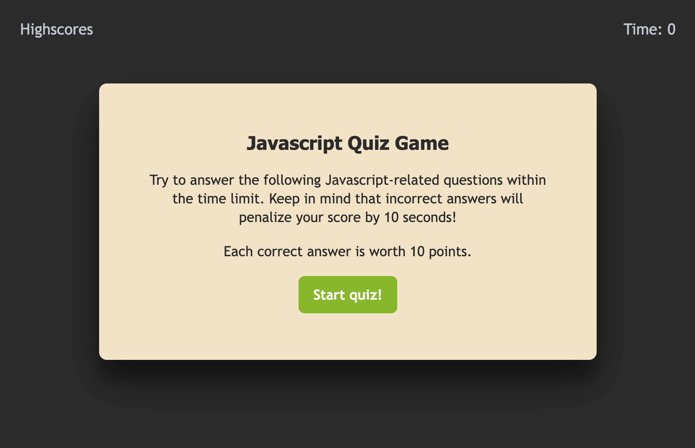

# Web APIs: Code Quiz challenge
## Description
Bootcamp week 4 Web APIs challenge where we create a timed Javascript Quiz Game that stores high scores.
## Installation
N/A
## Usage
Open [this website](https://skywalkah.github.io/code-quiz/) in Chrome. Click "Star Quiz" to start playing. Open Developer tools coonsole to look for errors.
## What it should look like

## Credits
N/A

## License
MIT license - Please refer to the LICENSE in the repo for more info.
